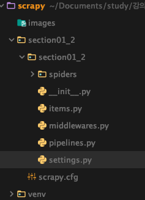

# scrapy

### scrapy project 생성
- scrapy startproject section01_2
- section01_2 > section01_2 로 디렉토리로 생성되어지고 기본파일들이 위치한다.  

### scrapy spider 생성
- `scrapy 명령어는 scrapy.cfg 파일있는 디렉토리 이동후에 실행한다.`
- scrapy genspider [spider name] [crawling 할 url]
- crawling 연습하기 좋은 site -  https://blog.scrapinghub.com/
- domain 뒤에 `robots.txt` 을 붙여보면 허용되지 않은 경로를 알 수 있다. 
    >https://blog.scrapinghub.com/robots.txt

### 실행방법
1. scrapy crawl [spider name]
    > scrapy crawl test1
    > scrapy crawl test1 --nolog : 진행과정 생략하기 
1. scrapy runspider [created spider file ]
    > 주의사항 : spider file 있는 디렉토리로 이동 후 실행해야함  
    scrapy runspider testspider.py
    - crawl vs runspider
    > crawl 는 클로러를 완성 후 사용하는 게 좋고  
    runspider는 단위테스트처럼 기능을 추가 후 테스트 할 때 용이하다. (spider 하나하나 실행 시킬)
1. 실행옵션 - 결과 파일로 생성하기 
- scrapy crawl test2 -o result.jl -t jsonlines
- scrapy crawl test2 -o result.csv -t csv
    > --output=FILE , -o File : 파일명.확장자
    --output-format=FORMAT, -t FORMAT : 파일타입(json, jsonlines, jl, csv, xml, marshal, pickle)

